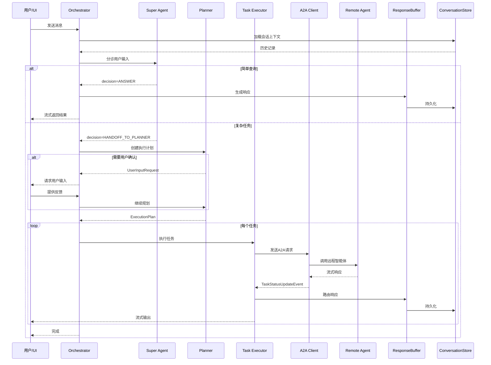

# ValueCell 架构设计文档

## 目录
- [架构概述](#架构概述)
- [核心设计原则](#核心设计原则)
- [系统架构](#系统架构)
- [核心编排系统](#核心编排系统)
- [智能体架构](#智能体架构)
- [数据层设计](#数据层设计)
- [通信协议](#通信协议)
- [配置系统](#配置系统)
[扩展性设计](#扩展性设计)
- [技术选型理由](#技术选型理由)

---

## 架构概述

ValueCell采用**模块化、异步、可重入**的多智能体架构，核心特点：

### 设计亮点

1. **Super Agent分诊机制** - 轻量级智能体首先分析用户输入，简单查询直接回答，复杂任务移交给规划器
2. **异步可重入编排器** - `process_user_input`流式返回响应，后台生产者持续运行，即使客户端断开连接
3. **人机协同规划（HITL）** - 规划器遇到信息缺失或风险步骤时暂停，等待用户反馈后继续
4. **流式处理管道** - A2A状态事件 → ResponseRouter（映射到BaseResponse）→ ResponseBuffer（注释/聚合）→ 持久化到存储并流式传输到UI
5. **Agent2Agent集成** - 任务通过`a2a-sdk`调用远程智能体；状态事件驱动路由；智能体可以通过轻量级装饰器/服务器包装
6. **会话记忆** - 内存/SQLite存储实现可复现的历史记录、快速"从上次继续"和可审计性
7. **健壮性** - 类型化错误、副作用（如失败任务）从路由器触发、支持重试/退避策略

### 架构图

```
┌─────────────────────────────────────────────────────────────┐
│                         用户界面层                           │
│                    (React + Tauri Desktop)                  │
│  ┌─────────────┐  ┌─────────────┐  ┌─────────────┐         │
│  │   对话界面   │  │  交易监控   │  │  自选列表   │         │
│  └─────────────┘  └─────────────┘  └─────────────┘         │
└────────────────┬────────────────────────────────────────────┘
                 │ HTTP/WebSocket (流式通信)
┌────────────────┴────────────────────────────────────────────┐
│                      API网关层 (FastAPI)                     │
│  ┌──────────┐  ┌──────────┐  ┌──────────┐  ┌──────────┐   │
│  │  /agents │  │ /tasks   │  │ /trading │  │ /watchlist│   │
│  └──────────┘  └──────────┘  └──────────┘  └──────────┘   │
└────────────────┬────────────────────────────────────────────┘
                 │
┌────────────────┴────────────────────────────────────────────┐
│                  核心编排层 (Orchestrator)                   │
│                                                              │
│  ┌────────────────────────────────────────────────────┐    │
│  │              AgentOrchestrator                      │    │
│  │  • 异步、可重入执行流                                │    │
│  │  • 管理Super Agent分诊                              │    │
│  │  • 协调规划与HITL                                   │    │
│  │  • 执行任务via A2A                                  │    │
│  │  • 流式响应到UI                                     │    │
│  │  • 维护会话上下文                                   │    │
│  └────────────────────────────────────────────────────┘    │
│                                                              │
│  ┌───────────┐ ┌───────────┐ ┌───────────┐ ┌──────────┐   │
│  │  Super    │ │  Plan     │ │   Task    │ │  Event   │   │
│  │  Agent    │ │  Service  │ │  Executor │ │ Response │   │
│  │  Service  │ │           │ │           │ │ Service  │   │
│  └───────────┘ └───────────┘ └───────────┘ └──────────┘   │
└────────────────┬────────────────────────────────────────────┘
                 │ A2A Protocol
┌────────────────┴────────────────────────────────────────────┐
│                      智能体层 (Agents)                       │
│                                                              │
│  ┌──────────────┐  ┌──────────────┐  ┌──────────────┐     │
│  │   Research   │  │ Auto Trading │  │   Strategy   │     │
│  │    Agent     │  │    Agent     │  │    Agent     │     │
│  │              │  │              │  │              │     │
│  │ • SEC文件    │  │ • 技术分析   │  │ • LLM决策    │     │
│  │ • 知识库RAG  │  │ • AI信号     │  │ • 护栏机制   │     │
│  │ • 网页搜索   │  │ • 仓位管理   │  │ • 历史反馈   │     │
│  └──────────────┘  └──────────────┘  └──────────────┘     │
│                                                              │
│  ┌──────────────┐  ┌──────────────┐                        │
│  │     News     │  │  Third-Party │                        │
│  │    Agent     │  │    Agents    │                        │
│  │              │  │              │                        │
│  │ • 定时推送   │  │ • Trading    │                        │
│  │ • 多渠道     │  │   Agents     │                        │
│  └──────────────┘  │ • AI Hedge   │                        │
│                     │   Fund       │                        │
│                     └──────────────┘                        │
└────────────────┬────────────────────────────────────────────┘
                 │
┌────────────────┴────────────────────────────────────────────┐
│                    数据与存储层                              │
│                                                              │
│  ┌──────────────┐  ┌──────────────┐  ┌──────────────┐     │
│  │   SQLite     │  │   LanceDB    │  │ Knowledge    │     │
│  │              │  │              │  │    Base      │     │
│  │ • 会话历史   │  │ • 向量嵌入   │  │              │     │
│  │ • 用户数据   │  │ • RAG搜索    │  │ • SEC文件    │     │
│  │ • 交易记录   │  │ • 语义搜索   │  │ • 文档缓存   │     │
│  └──────────────┘  └──────────────┘  └──────────────┘     │
└─────────────────────────────────────────────────────────────┘
```

---

## 核心设计原则

### 1. 模块化与单向依赖

**目标**：每个模块有明确的职责边界，依赖关系单向流动。

**实践**：
- 数据层 → 特征层 → 决策层 → 执行层 → 历史层
- 不允许反向依赖（通过回调或事件解耦）
- 每个模块可独立测试

**示例**（Strategy Agent）：
```
MarketDataSource → FeatureComputer → Composer → ExecutionGateway → HistoryRecorder
       ↓                                ↑
  get_candles()                   TradeDigest (只读反馈)
```

### 2. 异步优先

**目标**：充分利用I/O等待时间，提高并发处理能力。

**实践**：
- 所有外部调用使用`async/await`
- 智能体处理函数是异步的
- 数据库访问异步化（aiosqlite）
- 支持后台任务和定时任务

**代码模式**：
```python
async def process_user_input(self, user_input: str):
    # 异步调用Super Agent
    decision = await self.super_agent_service.run(user_input)

    if decision.type == "ANSWER":
        async for response in self._stream_responses(...):
            yield response
    else:
        # 异步规划
        plan = await self.plan_service.create_plan(...)

        # 并发执行任务
        tasks = [self.execute_task(t) for t in plan.tasks]
        results = await asyncio.gather(*tasks)
```

### 3. 可重入与容错

**目标**：支持长时间运行的任务，客户端可断开重连。

**实践**：
- 生产者-消费者解耦：后台生产者继续工作，前端消费者可取消
- 响应缓冲：`ResponseBuffer`实现幂等聚合，重连后可继续
- 执行上下文验证：TTL和用户一致性检查
- 检查点机制：HITL暂停点可保存状态

**流程**：
```
用户请求 → 创建执行上下文 → 后台生产者开始工作
    ↓
客户端断开（网络问题）
    ↓
后台继续执行任务
    ↓
客户端重连 → 从ResponseBuffer获取最新状态 → 继续流式输出
```

### 4. 人机协同（HITL）

**目标**：关键决策需要人类确认，提高安全性。

**触发场景**：
- 缺少必要参数
- 风险操作（大额交易、删除数据）
- 多个可选方案需要选择
- 规划不确定性高

**实现**：
```python
# Planner发出UserInputRequest
user_input_req = UserInputRequest(
    prompt="检测到大额交易，请确认是否继续？[Y/N]",
    context={"amount": 10000, "symbol": "BTC"}
)

# Orchestrator暂停并通知UI
yield PlanRequireUserInputResponse(prompt=user_input_req.prompt)

# 等待用户响应
user_response = await self.wait_for_user_input(context_id)

# 继续执行
plan = await planner.resume_with_input(user_response)
```

### 5. 可观测性与可审计性

**目标**：所有决策和执行可追溯、可回放。

**实践**：
- **唯一ID关联**：
  - `strategy_id` - 策略实例标识
  - `compose_id` - 决策周期标识
  - `instruction_id` - 指令标识
  - `trade_id` - 交易标识

- **历史记录**：
  ```python
  HistoryRecord(
      ts=datetime.now(),
      kind="compose",  # features/compose/instructions/execution
      reference_id=compose_id,
      payload={
          "prompt_hash": "abc123",
          "model": "gpt-4",
          "token_usage": 1200,
          "latency_ms": 350
      }
  )
  ```

- **日志结构化**：
  ```python
  logger.info(
      "Trade executed",
      extra={
          "compose_id": compose_id,
          "symbol": "BTC",
          "side": "BUY",
          "qty": 0.1,
          "price": 45000
      }
  )
  ```

### 6. 配置驱动

**目标**：通过配置而非代码调整行为。

**三层配置**：
```
环境变量 > .env文件 > YAML配置
```

**支持变量解析**：
```yaml
api_key: ${OPENROUTER_API_KEY:default_value}
model: ${MODEL_NAME:gpt-4}
```

---

## 系统架构

### 整体交互流程



### 数据流向

```
┌─────────────┐
│  用户输入    │
└──────┬──────┘
       ↓
┌──────────────────────────┐
│   Super Agent 分诊       │
│   • 意图识别             │
│   • 查询归一化           │
│   • 决策：回答/移交      │
└──────┬───────────────────┘
       ↓
┌──────────────────────────┐
│   Planner 规划           │
│   • 能力匹配             │
│   • 参数提取             │
│   • 生成执行计划         │
│   • HITL检查点           │
└──────┬───────────────────┘
       ↓
┌──────────────────────────┐
│   Task Executor 执行     │
│   • A2A协议调用          │
│   • 并发任务管理         │
│   • 状态事件路由         │
└──────┬───────────────────┘
       ↓
┌──────────────────────────┐
│   智能体处理             │
│   • Research Agent       │
│   • Auto Trading Agent   │
│   • Strategy Agent       │
└──────┬───────────────────┘
       ↓
┌──────────────────────────┐
│   Response Router        │
│   • 事件映射到Response   │
│   • 类型化响应           │
└──────┬───────────────────┘
       ↓
┌──────────────────────────┐
│   Response Buffer        │
│   • 添加稳定item_id      │
│   • 聚合部分响应         │
│   • 幂等性保证           │
└──────┬───────────────────┘
       ↓
┌──────────────────────────┐
│   持久化 & 流式输出      │
│   • ConversationStore    │
│   • ItemStore            │
│   • WebSocket Stream     │
└──────────────────────────┘
```

---

## 核心编排系统

### AgentOrchestrator

**位置**：`python/valuecell/core/coordinate/orchestrator.py`

**职责**：
1. 接收用户输入并管理执行生命周期
2. 委托Super Agent进行分诊
3. 运行Planner生成计划（支持HITL）
4. 通过Task Executor执行计划
5. 流式返回部分响应
6. 持久化结果

**关键方法**：

```python
class AgentOrchestrator:
    async def process_user_input(
        self,
        user_input: str,
        conversation_id: str,
        user_id: str,
        metadata: dict = None
    ) -> AsyncGenerator[BaseResponse, None]:
        """
        处理用户输入的主入口，返回异步生成器
        """
        # 1. 加载会话上下文
        context = await self.conversation_service.ensure_context(
            conversation_id, user_id
        )

        # 2. Super Agent分诊
        decision = await self.super_agent_service.run(user_input, context)

        if decision.type == DecisionType.ANSWER:
            # 简单查询，直接回答
            async for response in self._handle_direct_answer(decision):
                yield response
        else:
            # 复杂任务，移交给Planner
            enriched_query = decision.enriched_query

            # 3. 规划（支持HITL）
            plan = await self.plan_service.create_plan(
                query=enriched_query,
                context=context,
                callback=self._hitl_callback
            )

            # 4. 执行计划
            async for response in self._execute_plan(plan, context):
                yield response

    async def _hitl_callback(self, request: UserInputRequest):
        """HITL回调：暂停并请求用户输入"""
        # 通知UI需要用户输入
        await self.emit_response(
            PlanRequireUserInputResponse(prompt=request.prompt)
        )

        # 等待用户响应（阻塞）
        user_response = await self.wait_for_user_input(request.context_id)
        return user_response
```

### SuperAgentService

**位置**：`python/valuecell/core/super_agent/service.py`

**职责**：
- 快速分诊用户输入
- 判断是否可以直接回答
- 丰富和归一化查询

**决策类型**：
```python
class DecisionType(Enum):
    ANSWER = "answer"  # 直接回答
    HANDOFF_TO_PLANNER = "handoff_to_planner"  # 移交规划器

class SuperAgentOutcome(BaseModel):
    decision_type: DecisionType
    content: Optional[str]  # 如果ANSWER，这里是回答内容
    enriched_query: Optional[str]  # 如果HANDOFF，这里是丰富后的查询
    rationale: str  # 决策理由
```

**示例**：
```
用户输入："特斯拉股价多少？"
决策：ANSWER
内容："特斯拉(TSLA)当前股价为$245.32"

用户输入："帮我深度分析特斯拉的投资价值"
决策：HANDOFF_TO_PLANNER
丰富查询："获取特斯拉(TSLA)的最新10-K和10-Q财报，分析以下方面：
1. 财务健康状况（营收、利润、现金流）
2. 风险因素
3. 竞争优势
4. 估值水平
5. 投资建议"
```

### PlanService

**位置**：`python/valuecell/core/plan/service.py`

**职责**：
- 将自然语言转换为可执行计划
- 识别可用智能体和工具
- 处理参数缺失和歧义（触发HITL）
- 生成结构化执行计划

**执行计划数据结构**：
```python
class ExecutionPlan(BaseModel):
    plan_id: str
    tasks: List[Task]
    metadata: dict

class Task(BaseModel):
    task_id: str
    agent_name: str  # 要调用的智能体
    input_params: dict  # 输入参数
    depends_on: List[str] = []  # 依赖的任务ID
    schedule: Optional[Schedule] = None  # 定时任务配置
```

**规划流程**：
```
1. 分析用户意图
2. 匹配可用智能体能力（从capability cards）
3. 提取必需参数
4. 检查参数完整性
   ├─ 完整 → 生成计划
   └─ 缺失 → 触发UserInputRequest
5. 生成任务DAG（处理依赖关系）
6. 返回ExecutionPlan
```

### TaskExecutor

**位置**：`python/valuecell/core/task/executor.py`

**职责**：
- 执行任务（通过A2A协议）
- 管理定时任务
- 流式输出任务状态
- 处理任务失败和重试

**执行流程**：
```python
async def execute_task(self, task: Task) -> AsyncGenerator[TaskStatusUpdateEvent, None]:
    """执行单个任务"""
    # 1. 查找智能体连接
    agent_connection = self.remote_connections.get(task.agent_name)

    # 2. 发送A2A请求
    async for event in agent_connection.send_message(
        task.input_params,
        stream=True
    ):
        # 3. 路由事件到响应
        responses = await self.event_response_service.route(event)

        # 4. 流式输出
        for response in responses:
            yield response

    # 5. 记录任务完成
    await self.task_service.mark_completed(task.task_id)
```

**定时任务支持**：
```python
class Schedule(BaseModel):
    cron: str  # cron表达式，例如 "0 9 * * *" (每天9点)
    timezone: str = "UTC"
    accumulate_output: bool = True  # 是否累积输出

# 示例：每天9点推送新闻
Task(
    agent_name="news_agent",
    input_params={"symbols": ["AAPL", "TSLA"]},
    schedule=Schedule(cron="0 9 * * *")
)
```

### EventResponseService

**位置**：`python/valuecell/core/event/response_service.py`

**职责**：
- 将A2A事件映射到类型化响应
- 注释响应（添加item_id、timestamps）
- 聚合部分响应
- 持久化到存储

**响应类型**：
```python
class BaseResponse(BaseModel):
    response_type: str
    item_id: str  # 稳定ID，用于更新
    timestamp: datetime

class MessageResponse(BaseResponse):
    content: str  # 文本内容
    role: str = "assistant"

class ComponentResponse(BaseResponse):
    component_type: str  # chart/table/form
    data: dict

class ToolResultResponse(BaseResponse):
    tool_name: str
    result: Any
    status: str  # success/error

class ReasoningResponse(BaseResponse):
    steps: List[str]
```

**ResponseBuffer机制**：
```python
class ResponseBuffer:
    """幂等的响应聚合器"""

    def add(self, response: BaseResponse) -> bool:
        """
        添加响应，返回是否是新响应

        如果item_id已存在：
        - MessageResponse：追加内容
        - ComponentResponse：更新数据
        - 其他：替换
        """
        if response.item_id in self.buffer:
            existing = self.buffer[response.item_id]
            if isinstance(response, MessageResponse):
                existing.content += response.content
                return False  # 更新，不是新响应
            else:
                self.buffer[response.item_id] = response
                return True  # 替换视为新响应
        else:
            self.buffer[response.item_id] = response
            return True
```

---

## 智能体架构

### Research Agent

**位置**：`python/valuecell/agents/research_agent/`

**架构**：
```
┌─────────────────────────────────────┐
│         Research Agent              │
│                                     │
│  ┌──────────────────────────────┐  │
│  │   Core Agent (Agno)          │  │
│  │   • 对话管理                 │  │
│  │   • 推理链                   │  │
│  └─────────┬────────────────────┘  │
│            │                        │
│  ┌─────────┴────────────────────┐  │
│  │   Tools (功能工具)           │  │
│  │                              │  │
│  │  • search_sec_filings()      │  │
│  │  • search_china_filings()    │  │
│  │  • web_search()              │  │
│  │  • knowledge_base_search()   │  │
│  └──────────────────────────────┘  │
│                                     │
│  ┌──────────────────────────────┐  │
│  │   Knowledge Base (LanceDB)   │  │
│  │   • 文档嵌入                 │  │
│  │   • 向量搜索                 │  │
│  │   • 会话摘要                 │  │
│  └──────────────────────────────┘  │
└─────────────────────────────────────┘
```

**工具详解**：

1. **SEC Filing Search**
   ```python
   async def search_sec_filings(
       symbol: str,
       filing_type: str = "10-K",  # 10-K/10-Q/8-K
       limit: int = 5
   ) -> List[FilingSummary]:
       """搜索SEC文件"""
       # 使用edgartools库
       company = Company(symbol)
       filings = company.get_filings(form=filing_type).head(limit)

       summaries = []
       for filing in filings:
           # 提取关键部分
           text = filing.text()
           summary = await llm.summarize(text)
           summaries.append(summary)

       return summaries
   ```

2. **Knowledge Base RAG**
   ```python
   async def knowledge_base_search(
       query: str,
       top_k: int = 5
   ) -> List[Document]:
       """知识库向量搜索"""
       # 嵌入查询
       query_embedding = await embedding_model.embed(query)

       # LanceDB搜索
       results = knowledge_base.search(query_embedding).limit(top_k)

       return results.to_list()
   ```

**会话管理**：
- 使用Agno框架的会话存储
- 支持多轮对话上下文
- 自动生成会话摘要（超过一定长度）

### Auto Trading Agent

**位置**：`python/valuecell/agents/auto_trading_agent/`

**架构**：
```
┌──────────────────────────────────────────────────┐
│          Auto Trading Agent                      │
│                                                  │
│  ┌────────────────────────────────────────────┐ │
│  │   Portfolio Decision Manager               │ │
│  │   • 多资产分析                             │ │
│  │   • 组合优化                               │ │
│  └────────────┬───────────────────────────────┘ │
│               ↓                                  │
│  ┌────────────────────────────────────────────┐ │
│  │   Technical Analysis                       │ │
│  │   • MACD, RSI, EMA计算                     │ │
│  │   • AI信号生成（LLM分析）                  │ │
│  │   • 信号融合                               │ │
│  └────────────┬───────────────────────────────┘ │
│               ↓                                  │
│  ┌────────────────────────────────────────────┐ │
│  │   Position Manager                         │ │
│  │   • 仓位跟踪                               │ │
│  │   • 风险计算                               │ │
│  │   • P&L统计                                │ │
│  └────────────┬───────────────────────────────┘ │
│               ↓                                  │
│  ┌────────────────────────────────────────────┐ │
│  │   Trading Executor                         │ │
│  │   • 订单生成                               │ │
│  │   • 交易所API调用                          │ │
│  │   • 执行确认                               │ │
│  └────────────┬───────────────────────────────┘ │
│               ↓                                  │
│  ┌────────────────────────────────────────────┐ │
│  │   Exchange Integration                     │ │
│  │   • OKX (纸上交易/实盘)                    │ │
│  │   • Paper Trading                          │ │
│  └────────────────────────────────────────────┘ │
└──────────────────────────────────────────────────┘
```

**核心组件**：

1. **Technical Analysis** (`technical_analysis.py`)
   ```python
   class TechnicalAnalyzer:
       def calculate_indicators(self, df: pd.DataFrame) -> dict:
           """计算技术指标"""
           indicators = {}

           # MACD
           indicators['macd'] = ta.trend.macd_diff(df['close'])

           # RSI
           indicators['rsi'] = ta.momentum.rsi(df['close'])

           # EMA
           indicators['ema_12'] = ta.trend.ema_indicator(df['close'], 12)
           indicators['ema_26'] = ta.trend.ema_indicator(df['close'], 26)
           indicators['ema_50'] = ta.trend.ema_indicator(df['close'], 50)

           # 布林带
           bollinger = ta.volatility.BollingerBands(df['close'])
           indicators['bb_upper'] = bollinger.bollinger_hband()
           indicators['bb_lower'] = bollinger.bollinger_lband()

           return indicators

       async def generate_ai_signal(self, indicators: dict) -> TradeSignal:
           """使用LLM生成交易信号"""
           prompt = f"""
           基于以下技术指标，生成交易信号：
           {json.dumps(indicators, indent=2)}

           输出格式：
           {{
               "action": "BUY/SELL/HOLD",
               "type": "LONG/SHORT",
               "confidence": 0-100,
               "reasoning": "详细理由"
           }}
           """

           response = await llm.generate(prompt)
           return TradeSignal.parse_raw(response)
   ```

2. **Position Manager** (`position_manager.py`)
   ```python
   class PositionManager:
       def __init__(self, initial_capital: float, risk_per_trade: float = 0.02):
           self.capital = initial_capital
           self.risk_per_trade = risk_per_trade
           self.positions: Dict[str, Position] = {}

       def calculate_position_size(
           self,
           symbol: str,
           entry_price: float,
           stop_loss_price: float
       ) -> float:
           """计算仓位大小"""
           risk_amount = self.capital * self.risk_per_trade
           price_risk = abs(entry_price - stop_loss_price)
           position_size = risk_amount / price_risk
           return position_size

       def get_portfolio_metrics(self) -> dict:
           """获取组合指标"""
           total_pnl = sum(p.unrealized_pnl for p in self.positions.values())
           total_exposure = sum(p.notional for p in self.positions.values())

           return {
               "total_pnl": total_pnl,
               "pnl_pct": total_pnl / self.capital,
               "num_positions": len(self.positions),
               "exposure": total_exposure,
               "available_cash": self.capital - total_exposure
           }
   ```

3. **Trading Executor** (`trading_executor.py`)
   ```python
   class TradingExecutor:
       async def execute_signal(self, signal: TradeSignal):
           """执行交易信号"""
           # 1. 验证信号
           if signal.confidence < MIN_CONFIDENCE:
               logger.info(f"信号置信度不足: {signal.confidence}")
               return

           # 2. 计算仓位
           position_size = self.position_manager.calculate_position_size(...)

           # 3. 生成订单
           order = Order(
               symbol=signal.symbol,
               side=signal.action,
               qty=position_size,
               order_type="MARKET"
           )

           # 4. 提交订单
           result = await self.exchange.place_order(order)

           # 5. 更新仓位
           self.position_manager.update_position(result)

           # 6. 记录日志
           logger.info(f"订单执行: {result}")
   ```

### Strategy Agent

**位置**：`python/valuecell/agents/strategy_agent/`

**设计理念**：简洁的单向数据流

```
Data → Features → Composer(LLM+Guardrails) → Execution → History → Digest
  ↓                   ↑                                      ↓          ↑
  |                   |                                      |          |
  +-------------------+--------------------------------------+----------+
            PortfolioView              History Feedback Loop
```

**目录结构**：
```
strategy_agent/
├── models.py           # 数据模型（DTOs）
├── constants.py        # 常量配置
├── core.py             # DecisionCoordinator
├── data/
│   ├── interfaces.py   # MarketDataSource接口
│   └── market_data.py  # 实现
├── features/
│   ├── interfaces.py   # FeatureComputer接口
│   └── technical_indicators.py
├── decision/
│   ├── interfaces.py   # Composer接口
│   ├── composer.py     # LLM决策+护栏
│   └── system_prompt.py
├── execution/
│   ├── interfaces.py   # ExecutionGateway接口
│   ├── exchanges.py    # 交易所集成
│   └── paper_trading.py
├── portfolio/
│   ├── interfaces.py   # PortfolioService接口
│   └── service.py
└── trading_history/
    ├── interfaces.py   # HistoryRecorder接口
    ├── recorder.py
    └── digest.py       # DigestBuilder
```

**核心流程**（`core.py`）：
```python
class DecisionCoordinator:
    async def run_once(self):
        """执行一次决策周期"""
        # 1. 获取组合视图
        portfolio = await self.portfolio_service.get_view()

        # 2. 获取市场数据
        candles = await self.market_data.get_recent_candles(
            symbols=self.symbols,
            interval="1h",
            lookback=100
        )

        # 3. 计算特征
        features = await self.feature_computer.compute_features(candles)

        # 4. 构建上下文
        compose_id = generate_compose_id()
        digest = await self.digest_builder.build_latest()

        context = ComposeContext(
            ts=datetime.now(),
            compose_id=compose_id,
            features=features,
            portfolio=portfolio,
            digest=digest,
            prompt_text=self.strategy_prompt
        )

        # 5. LLM决策
        instructions = await self.composer.compose(context)

        # 6. 执行指令
        await self.execution_gateway.execute(instructions)

        # 7. 记录历史
        await self.history_recorder.record(
            HistoryRecord(
                ts=datetime.now(),
                kind="compose",
                reference_id=compose_id,
                payload={"instructions": instructions}
            )
        )

        # 8. 更新摘要
        await self.digest_builder.update()
```

**Composer设计**（`decision/composer.py`）：
```python
class Composer:
    async def compose(self, context: ComposeContext) -> List[TradeInstruction]:
        """
        LLM生成交易决策 + 护栏标准化

        流程：
        1. 构建提示（特征+组合+摘要）
        2. LLM生成LlmPlanProposal
        3. 应用护栏标准化为TradeInstruction
        """
        # 1. 构建提示
        prompt = self._build_prompt(context)

        # 2. 调用LLM
        llm_response = await self.llm.generate(prompt)
        proposal = LlmPlanProposal.parse_raw(llm_response)

        # 3. 应用护栏
        instructions = []
        for item in proposal.items:
            # 3.1 置信度过滤
            if item.confidence < self.min_confidence:
                continue

            # 3.2 冷却期检查
            if self._is_in_cooldown(item.instrument, context.digest):
                continue

            # 3.3 计算订单量（target - current）
            current_qty = context.portfolio.positions.get(
                item.instrument.symbol, 0
            )
            order_qty = item.target_qty - current_qty

            if abs(order_qty) < self.min_order_qty:
                continue  # 太小，忽略

            # 3.4 净敞口检查
            new_net_exposure = self._calculate_net_exposure(
                context.portfolio,
                item.instrument,
                order_qty
            )
            if abs(new_net_exposure) > self.max_net_exposure:
                continue  # 超过限制

            # 3.5 生成指令
            instruction = TradeInstruction(
                instruction_id=f"{context.compose_id}:{item.instrument.symbol}",
                compose_id=context.compose_id,
                instrument=item.instrument,
                side="BUY" if order_qty > 0 else "SELL",
                quantity=abs(order_qty),
                price_mode="MARKET"
            )
            instructions.append(instruction)

        return instructions
```

**护栏机制**：
- ✅ **置信度过滤**：低于阈值的决策被过滤
- ✅ **仓位目标控制**：计算`target_qty - current_qty`
- ✅ **最小订单量**：过滤太小的订单
- ✅ **净敞口上限**：防止过度杠杆
- ✅ **冷却期**：近期亏损的标的暂停交易
- ✅ **记录审计元数据**：prompt哈希、模型、token使用

**历史与摘要**（`trading_history/digest.py`）：
```python
class DigestBuilder:
    def build(self, records: List[HistoryRecord]) -> TradeDigest:
        """从历史记录构建摘要"""
        by_instrument = {}

        for record in records:
            if record.kind == "execution":
                symbol = record.payload["symbol"]
                if symbol not in by_instrument:
                    by_instrument[symbol] = TradeDigestEntry(
                        instrument=symbol,
                        trade_count=0,
                        realized_pnl=0.0
                    )

                entry = by_instrument[symbol]
                entry.trade_count += 1
                entry.realized_pnl += record.payload.get("pnl", 0)

                # 更新其他统计
                # win_rate, avg_holding_ms, max_drawdown等

        return TradeDigest(
            ts=datetime.now(),
            by_instrument=by_instrument
        )
```

**摘要反馈给Composer**：
- 冷却期：`last_trade_ts`距今是否小于冷却时间
- 绩效评分：`recent_performance_score`低于阈值则降权或跳过
- 风险控制：基于`max_drawdown`调整仓位

---

## 数据层设计

### 数据库架构

**SQLite主数据库**（`valuecell.db`）

表结构：
```sql
-- 智能体注册表
CREATE TABLE agents (
    id TEXT PRIMARY KEY,
    name TEXT NOT NULL,
    description TEXT,
    capabilities JSON,
    status TEXT,
    created_at TIMESTAMP
);

-- 自选列表
CREATE TABLE watchlists (
    id TEXT PRIMARY KEY,
    user_id TEXT NOT NULL,
    name TEXT,
    created_at TIMESTAMP
);

-- 自选项
CREATE TABLE watchlist_items (
    id TEXT PRIMARY KEY,
    watchlist_id TEXT,
    symbol TEXT,  -- 格式: EXCHANGE:SYMBOL
    added_at TIMESTAMP,
    FOREIGN KEY (watchlist_id) REFERENCES watchlists(id)
);

-- 用户配置
CREATE TABLE user_profiles (
    user_id TEXT PRIMARY KEY,
    preferences JSON,
    updated_at TIMESTAMP
);

-- 资产信息缓存
CREATE TABLE assets (
    symbol TEXT PRIMARY KEY,
    name TEXT,
    exchange TEXT,
    asset_type TEXT,
    metadata JSON,
    updated_at TIMESTAMP
);

-- 会话历史（可选，也可用内存存储）
CREATE TABLE conversations (
    id TEXT PRIMARY KEY,
    user_id TEXT,
    title TEXT,
    status TEXT,
    created_at TIMESTAMP,
    updated_at TIMESTAMP
);

-- 会话项（消息、工具结果等）
CREATE TABLE conversation_items (
    id TEXT PRIMARY KEY,
    conversation_id TEXT,
    item_type TEXT,
    content JSON,
    timestamp TIMESTAMP,
    FOREIGN KEY (conversation_id) REFERENCES conversations(id)
);
```

### 向量数据库（LanceDB）

**用途**：
- 文档嵌入存储
- 语义搜索
- RAG检索

**表结构**：
```python
# 知识库表
knowledge_base_table = lancedb.create_table(
    "knowledge_base",
    schema={
        "id": "string",
        "document_id": "string",
        "chunk_text": "string",
        "embedding": "vector(1536)",  # OpenAI embedding维度
        "metadata": "json",
        "created_at": "timestamp"
    }
)

# 会话摘要表
conversation_summary_table = lancedb.create_table(
    "conversation_summaries",
    schema={
        "conversation_id": "string",
        "summary_text": "string",
        "embedding": "vector(1536)",
        "timestamp": "timestamp"
    }
)
```

**检索流程**：
```python
async def search_knowledge_base(query: str, top_k: int = 5):
    # 1. 嵌入查询
    query_embedding = await embedding_model.embed(query)

    # 2. 向量搜索
    results = knowledge_base_table.search(query_embedding).limit(top_k)

    # 3. 返回文档
    documents = []
    for result in results:
        documents.append({
            "text": result["chunk_text"],
            "score": result["_distance"],
            "metadata": result["metadata"]
        })

    return documents
```

### 数据适配器

**位置**：`python/valuecell/adapters/assets/`

**架构**：
```
AdapterManager (路由)
    ├── YFinanceAdapter (美股、加密货币)
    ├── AKShareAdapter (A股、港股)
    └── FallbackChain (多源回退)
```

**AdapterManager**：
```python
class AdapterManager:
    def __init__(self):
        self.adapters = {
            "yfinance": YFinanceAdapter(),
            "akshare": AKShareAdapter()
        }

    async def get_price(self, symbol: str, exchange: str = None):
        """获取价格，自动路由到合适的数据源"""
        # 1. 根据交易所选择适配器
        adapter = self._select_adapter(exchange)

        # 2. 尝试获取数据
        try:
            return await adapter.get_price(symbol)
        except Exception as e:
            # 3. 回退到其他源
            logger.warning(f"主数据源失败: {e}, 尝试回退")
            return await self._fallback_fetch(symbol)

    def _select_adapter(self, exchange: str):
        """根据交易所选择适配器"""
        if exchange in ["NYSE", "NASDAQ", "CRYPTO"]:
            return self.adapters["yfinance"]
        elif exchange in ["SSE", "SZSE", "HKEX"]:
            return self.adapters["akshare"]
        else:
            return self.adapters["yfinance"]  # 默认
```

**YFinanceAdapter**：
```python
class YFinanceAdapter:
    async def get_price(self, symbol: str) -> float:
        """获取当前价格"""
        ticker = yf.Ticker(symbol)
        data = await asyncio.to_thread(ticker.history, period="1d")
        return data['Close'].iloc[-1]

    async def get_historical(
        self,
        symbol: str,
        start_date: str,
        end_date: str,
        interval: str = "1d"
    ) -> pd.DataFrame:
        """获取历史数据"""
        ticker = yf.Ticker(symbol)
        data = await asyncio.to_thread(
            ticker.history,
            start=start_date,
            end=end_date,
            interval=interval
        )
        return data
```

**AKShareAdapter**：
```python
class AKShareAdapter:
    async def get_price(self, symbol: str) -> float:
        """获取A股当前价格"""
        # AKShare使用股票代码（例如：000001.SZ）
        data = await asyncio.to_thread(
            ak.stock_zh_a_spot_em
        )
        row = data[data['代码'] == symbol]
        return float(row['最新价'].iloc[0])

    async def get_historical(
        self,
        symbol: str,
        start_date: str,
        end_date: str
    ) -> pd.DataFrame:
        """获取历史数据"""
        data = await asyncio.to_thread(
            ak.stock_zh_a_hist,
            symbol=symbol,
            start_date=start_date.replace("-", ""),
            end_date=end_date.replace("-", ""),
            adjust="qfq"  # 前复权
        )
        return data
```

---

## 通信协议

### A2A（Agent-to-Agent）协议

**目标**：标准化智能体间通信，实现位置透明。

**消息格式**：
```python
class A2AMessage(BaseModel):
    message_id: str
    from_agent: str
    to_agent: str
    message_type: str  # request/response/event
    payload: dict
    metadata: dict

class A2ARequest(A2AMessage):
    message_type: Literal["request"]
    method: str  # 调用的方法名
    params: dict  # 参数

class A2AResponse(A2AMessage):
    message_type: Literal["response"]
    request_id: str  # 关联的请求ID
    status: str  # success/error
    result: Any

class A2AEvent(A2AMessage):
    message_type: Literal["event"]
    event_type: str  # task_status_update/progress等
    data: dict
```

**智能体能力卡片**：
```yaml
# python/configs/agent_cards/research_agent.yaml
name: research_agent
display_name: "深度研究智能体"
description: "自动检索和分析财报、新闻等文档"

capabilities:
  - name: analyze_sec_filing
    description: "分析SEC财报"
    inputs:
      - name: symbol
        type: string
        required: true
      - name: filing_type
        type: string
        enum: ["10-K", "10-Q", "8-K"]
        default: "10-K"
    outputs:
      - name: summary
        type: string
      - name: key_metrics
        type: object

  - name: search_news
    description: "搜索相关新闻"
    inputs:
      - name: query
        type: string
        required: true
      - name: days_back
        type: integer
        default: 7
    outputs:
      - name: articles
        type: array
```

**智能体装饰器**：
```python
from valuecell.core.agent.decorator import agent

@agent(
    name="research_agent",
    card_path="configs/agent_cards/research_agent.yaml"
)
async def handle_research_request(request: A2ARequest) -> AsyncGenerator[A2AEvent, None]:
    """
    研究智能体处理函数

    自动：
    - 解析请求参数
    - 验证输入
    - 流式输出事件
    - 错误处理
    """
    method = request.method
    params = request.params

    if method == "analyze_sec_filing":
        symbol = params["symbol"]
        filing_type = params.get("filing_type", "10-K")

        # 流式输出进度
        yield A2AEvent(
            event_type="progress",
            data={"status": "fetching", "message": f"正在获取{symbol}的{filing_type}文件"}
        )

        # 执行分析
        filing = await fetch_sec_filing(symbol, filing_type)
        summary = await analyze_filing(filing)

        # 返回结果
        yield A2AEvent(
            event_type="result",
            data={"summary": summary, "key_metrics": filing.metrics}
        )
```

**连接与路由**（`agent/connect.py`）：
```python
class RemoteConnections:
    """管理远程智能体连接"""

    def __init__(self):
        self.connections: Dict[str, AgentConnection] = {}

    def register(self, agent_name: str, connection: AgentConnection):
        """注册智能体连接"""
        self.connections[agent_name] = connection

    async def send_message(
        self,
        agent_name: str,
        request: A2ARequest,
        stream: bool = True
    ) -> AsyncGenerator[A2AEvent, None]:
        """发送消息到远程智能体"""
        connection = self.connections.get(agent_name)
        if not connection:
            raise ValueError(f"未找到智能体: {agent_name}")

        async for event in connection.send(request, stream=stream):
            yield event
```

### WebSocket流式通信

**前后端实时通信**：

**后端**（FastAPI）：
```python
from fastapi import WebSocket

@app.websocket("/ws/agent/stream")
async def agent_stream_ws(websocket: WebSocket):
    await websocket.accept()

    try:
        # 接收用户消息
        data = await websocket.receive_json()
        user_input = data["message"]
        conversation_id = data["conversation_id"]

        # 处理并流式返回
        async for response in orchestrator.process_user_input(
            user_input,
            conversation_id
        ):
            await websocket.send_json(response.dict())

        # 发送完成信号
        await websocket.send_json({"type": "done"})

    except WebSocketDisconnect:
        logger.info("客户端断开连接")
    except Exception as e:
        logger.error(f"WebSocket错误: {e}")
        await websocket.send_json({
            "type": "error",
            "message": str(e)
        })
```

**前端**（React）：
```typescript
// src/api/agentStream.ts
export async function streamAgentResponse(
  message: string,
  conversationId: string,
  onChunk: (response: AgentResponse) => void
): Promise<void> {
  const ws = new WebSocket('ws://localhost:8000/ws/agent/stream');

  ws.onopen = () => {
    ws.send(JSON.stringify({
      message,
      conversation_id: conversationId
    }));
  };

  ws.onmessage = (event) => {
    const response = JSON.parse(event.data);

    if (response.type === 'done') {
      ws.close();
      return;
    }

    if (response.type === 'error') {
      console.error('Agent error:', response.message);
      return;
    }

    onChunk(response);
  };

  ws.onerror = (error) => {
    console.error('WebSocket error:', error);
  };
}
```

---

## 配置系统

### 三层优先级

```
1. 环境变量 (最高)
   ├─ OS环境变量
   └─ .env文件
        ↓
2. 运行时覆盖
   └─ 代码中动态设置
        ↓
3. YAML配置 (默认)
   └─ configs/*.yaml
```

### 变量解析

**语法**：`${VAR_NAME:default_value}`

**示例**：
```yaml
# configs/providers/openrouter.yaml
provider: openrouter
api_key: ${OPENROUTER_API_KEY:}  # 从环境变量读取
base_url: ${OPENROUTER_BASE_URL:https://openrouter.ai/api/v1}

models:
  default: ${OPENROUTER_DEFAULT_MODEL:anthropic/claude-3.5-sonnet}

  reasoning:
    id: ${REASONING_MODEL:openai/o1-preview}
    temperature: 1.0
```

**加载逻辑**：
```python
import os
import re
from typing import Any

def resolve_env_vars(value: Any) -> Any:
    """递归解析环境变量"""
    if isinstance(value, str):
        # 匹配 ${VAR:default}
        pattern = r'\$\{([^:}]+)(?::([^}]*))?\}'

        def replacer(match):
            var_name = match.group(1)
            default = match.group(2) or ""
            return os.environ.get(var_name, default)

        return re.sub(pattern, replacer, value)

    elif isinstance(value, dict):
        return {k: resolve_env_vars(v) for k, v in value.items()}

    elif isinstance(value, list):
        return [resolve_env_vars(item) for item in value]

    else:
        return value
```

### 配置文件组织

```
configs/
├── config.yaml              # 主配置
├── providers/               # LLM提供商配置
│   ├── openrouter.yaml
│   ├── google.yaml
│   ├── openai.yaml
│   ├── siliconflow.yaml
│   └── azure.yaml
├── agents/                  # 智能体配置
│   ├── super_agent.yaml
│   ├── research_agent.yaml
│   ├── auto_trading_agent.yaml
│   └── strategy_agent.yaml
├── agent_cards/             # 智能体能力卡片
│   ├── research_agent.yaml
│   ├── auto_trading_agent.yaml
│   └── ...
└── locales/                 # 国际化
    ├── en.yaml
    ├── zh_CN.yaml
    └── ja.yaml
```

### 配置加载器

**位置**：`python/valuecell/config/config_loader.py`

```python
class ConfigLoader:
    def __init__(self, config_dir: Path):
        self.config_dir = config_dir
        self._cache = {}

    def load(self, config_path: str) -> dict:
        """加载并缓存配置"""
        if config_path in self._cache:
            return self._cache[config_path]

        full_path = self.config_dir / config_path

        with open(full_path) as f:
            raw_config = yaml.safe_load(f)

        # 解析环境变量
        resolved_config = resolve_env_vars(raw_config)

        self._cache[config_path] = resolved_config
        return resolved_config

    def get_agent_config(self, agent_name: str) -> dict:
        """获取智能体配置"""
        # 1. 加载主配置
        main_config = self.load("config.yaml")

        # 2. 获取智能体配置文件路径
        agent_config_file = main_config["agents"][agent_name]["config_file"]

        # 3. 加载智能体配置
        agent_config = self.load(agent_config_file)

        return agent_config

    def get_model_config(self, provider: str) -> dict:
        """获取模型提供商配置"""
        main_config = self.load("config.yaml")
        provider_config_file = main_config["models"]["providers"][provider]["config_file"]
        return self.load(provider_config_file)
```

---

## 扩展性设计

### 添加新智能体

**步骤**：

1. **创建能力卡片**
   ```yaml
   # configs/agent_cards/my_agent.yaml
   name: my_agent
   display_name: "我的智能体"
   description: "自定义功能描述"

   capabilities:
     - name: my_function
       description: "功能说明"
       inputs:
         - name: param1
           type: string
           required: true
       outputs:
         - name: result
           type: object
   ```

2. **实现处理函数**
   ```python
   # python/valuecell/agents/my_agent/core.py
   from valuecell.core.agent.decorator import agent

   @agent(
       name="my_agent",
       card_path="configs/agent_cards/my_agent.yaml"
   )
   async def handle_my_agent(request: A2ARequest):
       # 实现逻辑
       yield A2AEvent(event_type="result", data={...})
   ```

3. **注册智能体**
   ```python
   # python/scripts/launch.py
   from valuecell.agents.my_agent.core import handle_my_agent

   # 添加到启动列表
   agents = [
       handle_my_agent,
       # ... 其他智能体
   ]
   ```

4. **配置智能体**
   ```yaml
   # configs/agents/my_agent.yaml
   agent:
     name: my_agent
     model:
       provider: openrouter
       id: anthropic/claude-3.5-sonnet
   ```

### 添加新数据源

**实现接口**：
```python
from valuecell.adapters.assets.base import BaseAdapter

class MyDataAdapter(BaseAdapter):
    async def get_price(self, symbol: str) -> float:
        # 实现价格获取
        pass

    async def get_historical(
        self,
        symbol: str,
        start_date: str,
        end_date: str
    ) -> pd.DataFrame:
        # 实现历史数据获取
        pass

    async def search_assets(self, query: str) -> List[Asset]:
        # 实现资产搜索
        pass
```

**注册到AdapterManager**：
```python
# valuecell/adapters/assets/manager.py
class AdapterManager:
    def __init__(self):
        self.adapters = {
            "yfinance": YFinanceAdapter(),
            "akshare": AKShareAdapter(),
            "my_source": MyDataAdapter(),  # 添加新适配器
        }
```

### 添加新LLM提供商

1. **创建提供商配置**
   ```yaml
   # configs/providers/my_provider.yaml
   provider: my_provider
   api_key: ${MY_PROVIDER_API_KEY:}
   base_url: https://api.myprovider.com/v1

   models:
     default: my-model-id
     reasoning: my-reasoning-model
   ```

2. **注册到主配置**
   ```yaml
   # configs/config.yaml
   models:
     providers:
       my_provider:
         config_file: "providers/my_provider.yaml"
         api_key_env: "MY_PROVIDER_API_KEY"
   ```

3. **实现模型工厂**（如果需要特殊处理）
   ```python
   # valuecell/adapters/models/factory.py
   def create_model(provider: str, config: dict):
       if provider == "my_provider":
           return MyProviderModel(config)
       # ... 其他提供商
   ```

### 扩展Strategy Agent特征

**添加新特征计算器**：
```python
# valuecell/agents/strategy_agent/features/my_features.py
from .interfaces import FeatureComputer

class MyFeatureComputer(FeatureComputer):
    async def compute_features(
        self,
        candles: List[Candle]
    ) -> List[FeatureVector]:
        """计算自定义特征"""
        features = []

        for candle in candles:
            # 计算自定义指标
            my_indicator = self.calculate_my_indicator(candle)

            features.append(
                FeatureVector(
                    ts=candle.ts,
                    instrument=candle.instrument,
                    values={
                        "my_indicator": my_indicator,
                        # ... 更多特征
                    }
                )
            )

        return features
```

**在DecisionCoordinator中使用**：
```python
coordinator = DecisionCoordinator(
    feature_computer=MyFeatureComputer(),
    # ... 其他组件
)
```

---

## 技术选型理由

### 为什么选择Python？

1. **丰富的金融和AI生态**
   - pandas, numpy - 数据处理
   - ta-lib, pandas-ta - 技术分析
   - langchain, agno - AI框架
   - yfinance, akshare - 市场数据

2. **异步性能**
   - asyncio原生支持
   - FastAPI高性能异步Web框架
   - aiohttp并发HTTP请求

3. **开发效率**
   - 类型提示（Python 3.12+）
   - Pydantic数据验证
   - 丰富的第三方库

### 为什么选择FastAPI？

1. **性能**：基于Starlette和Pydantic，接近Node.js和Go
2. **异步优先**：原生async/await支持
3. **自动文档**：Swagger UI和ReDoc
4. **类型安全**：基于Python类型提示
5. **WebSocket**：原生支持流式通信

### 为什么选择Tauri？

1. **轻量级**：比Electron小10-20倍
2. **性能**：Rust编写，原生性能
3. **安全**：默认安全，细粒度权限控制
4. **跨平台**：Windows、macOS、Linux

### 为什么选择LanceDB？

1. **向量搜索**：专为RAG优化
2. **嵌入式**：无需单独服务器
3. **性能**：Rust编写，快速查询
4. **兼容性**：与Python生态集成良好

### 为什么选择Agno框架？

1. **多提供商支持**：OpenAI、Google、Azure等
2. **工具调用**：简化函数调用集成
3. **会话管理**：内置对话历史
4. **流式输出**：支持实时响应

---

## 总结

ValueCell的架构设计核心原则：

1. **模块化** - 清晰的职责边界，单向依赖
2. **异步化** - 充分利用I/O并发
3. **可重入** - 支持长时间运行和断点续传
4. **人机协同** - 关键决策需要确认
5. **可观测** - 所有行为可追溯
6. **可扩展** - 插件化架构，易于添加新功能

这种设计确保了系统的：
- **可维护性** - 模块独立，易于修改
- **可测试性** - 接口清晰，易于单元测试
- **可扩展性** - 新功能通过注册机制添加
- **健壮性** - 错误处理和重试机制
- **性能** - 异步并发，高效利用资源

---

**下一步阅读**：
- [回测指南](./BACKTESTING_GUIDE_CN.md) - 学习如何回测策略
- [部署指南](./DEPLOYMENT_GUIDE_CN.md) - 生产环境部署
- [生产使用指南](./PRODUCTION_GUIDE_CN.md) - 实战技巧和优化
