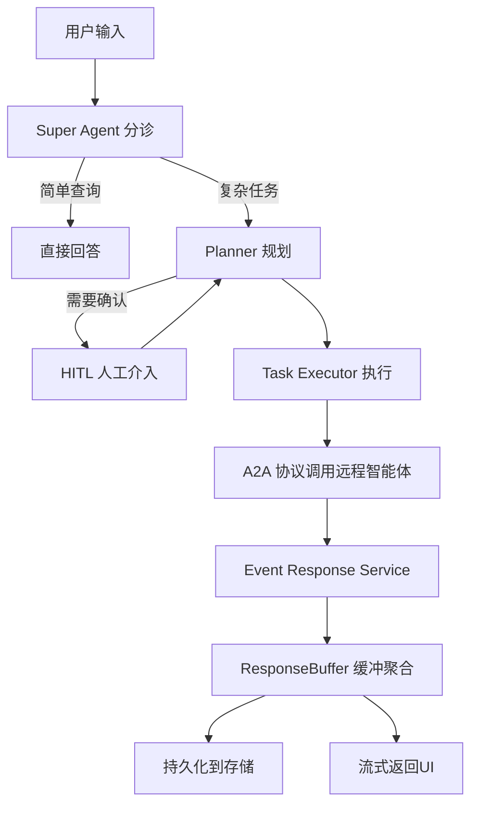

# ValueCell 中文完整指南

## 目录
- [项目概述](#项目概述)
- [核心价值](#核心价值)
- [系统架构](#系统架构)
- [核心功能](#核心功能)
- [技术栈](#技术栈)
- [快速开始](#快速开始)
- [配置说明](#配置说明)
- [使用指南](#使用指南)
- [相关文档](#相关文档)

---

## 项目概述

**ValueCell** 是一个社区驱动的金融多智能体平台，致力于构建全球最大的去中心化金融智能体社区。

### 使命与愿景

ValueCell 的使命是为用户提供一支**顶级投资智能体团队**，帮助用户完成：
- 📊 **股票筛选** - AI驱动的多维度选股
- 🔍 **深度研究** - 自动化的基本面分析和财报解读
- 📈 **实时追踪** - 多市场资产监控和预警
- 🤖 **自动交易** - AI增强的量化交易策略

### 项目定位

ValueCell 不仅仅是一个交易工具，而是一个**完整的金融AI生态系统**：
- **开源社区项目** - 欢迎开发者贡献智能体和策略
- **多智能体协作** - 不同专业领域的AI协同工作
- **生产级质量** - 企业级安全性和稳定性设计
- **易于扩展** - 基于A2A协议的插件化架构

---

## 核心价值

### 1. 智能化投资研究

#### 传统投资研究的痛点
- ❌ 手工阅读财报耗时长（一份10-K报告超过100页）
- ❌ 信息分散在多个数据源（SEC、交易所、新闻、社交媒体）
- ❌ 难以持续追踪数百只股票
- ❌ 情绪化决策导致亏损

#### ValueCell 的解决方案
- ✅ **自动化文档检索** - Research Agent 自动获取和分析SEC文件（10-K、10-Q、8-K）
- ✅ **智能摘要生成** - AI提取关键财务指标和风险因素
- ✅ **知识库RAG** - 基于LanceDB的向量搜索，快速检索历史研究
- ✅ **多源信息整合** - 整合财报、新闻、市场数据的综合分析

**价值量化**：
- 节省时间：从2小时/份报告 → 5分钟/份报告（节约95%+时间）
- 覆盖广度：可同时追踪数十只股票，人工难以做到
- 决策质量：基于数据和历史模式，减少情绪化决策

### 2. AI驱动的量化交易

#### 传统量化交易的挑战
- ❌ 策略开发周期长（数周到数月）
- ❌ 需要专业编程和金融知识
- ❌ 回测和实盘存在差异（滑点、成本）
- ❌ 难以快速适应市场变化

#### ValueCell 的优势
- ✅ **LLM驱动决策** - Strategy Agent 使用大语言模型分析市场特征
- ✅ **内置安全护栏** - 风险控制、仓位限制、冷却期机制
- ✅ **模拟交易优先** - 默认纸上交易，验证后再上线
- ✅ **快速迭代** - 通过提示词调整策略，无需重写代码

**Auto Trading Agent 特性**：
```
技术指标 + AI信号 = 交易决策
  MACD         LLM分析    →  买入/卖出
  RSI          置信度      →  仓位大小
  布林带       风险评估    →  止损价格
```

**Strategy Agent 架构**：
```
市场数据 → 特征工程 → Composer(LLM+护栏) → 执行 → 历史记录 → 摘要反馈
```

**价值量化**：
- 降低门槛：非程序员也能使用AI策略
- 提升收益：AI可以发现人类难以察觉的模式
- 风险控制：每笔交易默认2%风险限制，最大3个仓位

### 3. 多智能体协作系统

#### 单一工具的局限性
- ❌ 单一AI视角可能存在盲区
- ❌ 无法同时处理研究、交易、监控多个任务
- ❌ 缺乏专业化分工

#### ValueCell 的多智能体架构
```
用户请求
   ↓
Super Agent (分诊)
   ↓
Planner (规划执行路径)
   ↓
┌────────────┬────────────┬────────────┐
│  Research  │   Auto     │   News     │
│   Agent    │  Trading   │   Agent    │
│           │   Agent    │           │
│ 深度研究   │  自动交易  │  新闻推送  │
└────────────┴────────────┴────────────┘
   ↓
结果聚合 → 流式返回给用户
```

**协作示例**：
用户："帮我分析特斯拉的投资价值，并设置自动交易"
1. **Super Agent** 分析意图 → 需要研究+交易
2. **Research Agent** 获取财报 → 分析业绩
3. **Auto Trading Agent** 设置策略 → 监控价格
4. **News Agent** 订阅特斯拉新闻 → 推送重要事件

### 4. 全球市场覆盖

支持的市场：
- 🇺🇸 **美股** - NYSE、NASDAQ（通过YFinance）
- ₿ **加密货币** - BTC、ETH等（OKX交易所）
- 🇨🇳 **A股/港股** - 沪深、香港市场（AKShare）
- 🌍 **国际市场** - 其他全球市场

### 5. 安全性与合规性

**多层安全机制**：
1. **纸上交易默认** - 必须显式启用实盘交易
2. **网络隔离** - 模拟环境和实盘环境分离
3. **风险限制** - 仓位上限、单笔风险上限
4. **审计日志** - 所有决策可追溯（compose_id）
5. **人机协同（HITL）** - 关键决策需要人工确认

---

## 系统架构

### 三层架构设计

```
┌─────────────────────────────────────────┐
│         前端层 (React + Tauri)          │
│    - 桌面应用程序                        │
│    - 实时流式界面                        │
│    - 响应式设计                          │
└──────────────┬──────────────────────────┘
               │ HTTP/WebSocket
┌──────────────┴──────────────────────────┐
│      后端层 (FastAPI + Python)          │
│    - RESTful API                        │
│    - 智能体编排                          │
│    - A2A协议集成                        │
│    - 会话管理                            │
└──────────────┬──────────────────────────┘
               │
┌──────────────┴──────────────────────────┐
│        智能体层 (Multi-Agent)           │
│  - Research Agent (研究智能体)          │
│  - Auto Trading Agent (自动交易)        │
│  - Strategy Agent (策略智能体)          │
│  - News Agent (新闻智能体)              │
│  - TradingAgents (第三方集成)           │
└─────────────────────────────────────────┘
```

### 核心编排流程



### 数据流动

```
┌──────────────┐
│ 市场数据源    │  YFinance, AKShare, OKX
└──────┬───────┘
       ↓
┌──────────────┐
│ 数据适配器    │  统一接口，多源回退
└──────┬───────┘
       ↓
┌──────────────┐
│ 智能体处理    │  技术分析、AI决策
└──────┬───────┘
       ↓
┌──────────────┐
│ 执行层       │  纸上交易/实盘交易
└──────┬───────┘
       ↓
┌──────────────┐
│ 历史记录     │  审计、回顾、学习
└──────────────┘
```

---

## 核心功能

### 1. Research Agent (深度研究智能体)

**功能清单**：
- ✅ SEC文件检索（10-K年报、10-Q季报、8-K事件报告）
- ✅ 中国A股公告检索
- ✅ 网页搜索和爬取（当前事件）
- ✅ 知识库RAG（基于LanceDB的向量搜索）
- ✅ 对话历史管理和摘要

**使用场景**：
```
用户："分析苹果公司2024年Q4财报"
Research Agent：
1. 检索最新10-Q文件
2. 提取关键财务指标（营收、利润、现金流）
3. 分析风险因素章节
4. 对比历史数据
5. 生成摘要报告
```

**技术实现**：
- 使用 `edgartools` 库访问SEC EDGAR数据库
- 使用 `crawl4ai` 进行网页爬取
- 使用 Gemini 2.5 Flash 作为默认模型
- 向量嵌入存储在 LanceDB

### 2. Auto Trading Agent (自动交易智能体)

**功能清单**：
- ✅ 多实例支持（每个用户可运行多个交易会话）
- ✅ 技术分析（MACD、RSI、EMA、布林带）
- ✅ AI信号生成（LLM分析技术指标）
- ✅ 仓位管理（风险控制）
- ✅ 纸上交易和实盘交易模式

**风险管理参数**：
```python
默认配置：
- 单笔交易风险: 2% 的总资金
- 最大仓位数: 3 个同时持仓
- 仓位大小: 基于资金量动态计算
- 止损机制: 基于ATR或固定百分比
```

**技术分析指标**：
1. **MACD** - 趋势跟踪
2. **RSI** - 超买超卖判断
3. **EMA** - 移动平均（12、26、50周期）
4. **布林带** - 波动率和价格通道

**AI增强决策**：
```
输入：技术指标数据
LLM分析：
  - 交易动作: BUY/SELL/HOLD
  - 交易类型: LONG/SHORT
  - 置信度: 0-100%
  - 理由说明: 详细分析
输出：执行指令
```

**支持的交易所**：
- **OKX** - 主要加密货币交易所
- **Paper Trading** - 内置模拟交易
- **Binance** - 计划支持

### 3. Strategy Agent (策略智能体)

**核心设计理念**：
```
简洁的单向依赖流：
数据 → 特征 → Composer(LLM+护栏) → 执行 → 历史 → 摘要
```

**关键组件**：

1. **Data Layer** - 市场数据源
   - 获取K线数据
   - 多时间周期支持

2. **Features Layer** - 特征工程
   - 技术指标计算
   - 多模态分析（未来可扩展）

3. **Decision Layer** - LLM驱动决策
   - Composer: LLM生成交易决策
   - 护栏: 标准化输出为可执行指令

4. **Execution Layer** - 执行网关
   - 交易所集成
   - 纸上交易

5. **History & Digest** - 历史记录和摘要
   - 记录所有决策和执行
   - 构建历史绩效摘要
   - 反馈给Composer优化决策

**护栏机制**：
- ✅ 仓位目标控制
- ✅ 最小订单量和名义价值
- ✅ 净敞口上限
- ✅ 亏损标的冷却期
- ✅ 置信度阈值过滤

**可审计性**：
- 每次决策有唯一的 `compose_id`
- 记录提示哈希、模型名称、token使用量
- 所有指令与执行结果关联

### 4. News Agent (新闻智能体)

**功能清单**：
- ✅ 定时新闻检索
- ✅ 个性化推送
- ✅ 多渠道交付（计划支持Discord、Webhook）

### 5. 第三方智能体集成

**TradingAgents**：
- 多分析师智能体
- 市场分析、情绪分析、新闻分析、基本面分析

**AI Hedge Fund**：
- 模拟著名投资者风格：
  - Warren Buffett（价值投资）
  - Charlie Munger（理性分析）
  - Peter Lynch（成长股）
  - Michael Burry（逆向投资）
  - Cathie Wood（科技创新）

---

## 技术栈

### 后端技术

| 技术 | 用途 | 优势 |
|------|------|------|
| **Python 3.12+** | 主要编程语言 | 丰富的金融/AI库生态 |
| **FastAPI** | Web框架 | 高性能异步、自动文档 |
| **uv** | 包管理器 | Rust编写，极速依赖管理 |
| **Agno** | 智能体框架 | 支持多LLM提供商 |
| **a2a-sdk** | 智能体通信 | 标准化A2A协议 |
| **SQLAlchemy** | ORM | 数据库抽象 |
| **LanceDB** | 向量数据库 | RAG和嵌入搜索 |
| **asyncio** | 异步运行时 | 高并发处理 |

### 前端技术

| 技术 | 用途 | 优势 |
|------|------|------|
| **React 19.2** | UI框架 | 最新特性，组件化 |
| **Tauri 2.x** | 桌面应用 | Rust编写，轻量级 |
| **Tailwind CSS 4** | 样式框架 | 实用优先，快速开发 |
| **Zustand** | 状态管理 | 轻量级，易用 |
| **Bun** | 运行时/包管理 | 快速编译和安装 |
| **ECharts** | 图表库 | 强大的金融图表 |

### 数据源

| 数据源 | 覆盖范围 | 用途 |
|--------|----------|------|
| **YFinance** | 美股、加密货币、国际市场 | 价格、历史数据 |
| **AKShare** | 中国A股、港股 | 东方财富数据接口 |
| **SEC Edgar** | 美国上市公司 | 财报、公告 |
| **Finnhub** | 全球市场 | 新闻、内部交易 |
| **OKX API** | 加密货币 | 实时交易 |

### LLM提供商

| 提供商 | 特点 | 推荐使用场景 |
|--------|------|-------------|
| **OpenRouter** | 聚合多模型 | 快速切换模型，推荐 |
| **SiliconFlow** | 成本优化 | 中文模型，性价比高 |
| **Google Gemini** | 长上下文 | 文档分析、研究 |
| **OpenAI** | 高质量 | 关键决策 |
| **Azure OpenAI** | 企业级 | 生产环境 |

---

## 快速开始

### 前置要求

**必需工具**：
```bash
# 安装 uv（Python包管理器）
curl -LsSf https://astral.sh/uv/install.sh | sh

# 安装 bun（JavaScript包管理器）
curl -fsSL https://bun.sh/install | bash
```

**系统要求**：
- Python 3.12+
- Node.js（通过bun）
- 操作系统：Linux、macOS、Windows

### 安装步骤

**1. 克隆仓库**
```bash
git clone https://github.com/ValueCell-ai/valuecell.git
cd valuecell
```

**2. 配置环境变量**
```bash
cp .env.example .env
```

编辑 `.env` 文件，至少配置一个LLM提供商：

**最小配置**（只需API密钥）：
```bash
# OpenRouter（推荐）
OPENROUTER_API_KEY=your_openrouter_api_key

# 或者使用其他提供商
GOOGLE_API_KEY=your_google_api_key
# OPENAI_API_KEY=your_openai_api_key
# SILICONFLOW_API_KEY=your_siliconflow_api_key
```

**完整配置**（用于研究型智能体）：
```bash
# LLM提供商
OPENROUTER_API_KEY=your_key

# 嵌入模型（用于RAG）
GOOGLE_API_KEY=your_key  # 用于Gemini嵌入

# 数据源（可选）
FINNHUB_API_KEY=your_key
```

**3. 启动应用**

Linux/macOS:
```bash
bash start.sh
```

Windows (PowerShell):
```powershell
.\start.ps1
```

启动脚本会自动：
1. 检查并安装 `bun` 和 `uv`
2. 同步Python依赖（`uv sync`）
3. 初始化数据库（`init_db.py`）
4. 安装前端依赖（`bun install`）
5. 启动前端开发服务器（端口1420）
6. 启动后端和智能体（端口8000）

**4. 访问界面**

打开浏览器访问：[http://localhost:1420](http://localhost:1420)

**5. 查看日志**

日志位置：`logs/{timestamp}/*.log`
- `server.log` - 后端服务日志
- `research_agent.log` - 研究智能体日志
- `auto_trading_agent.log` - 交易智能体日志
- 等等

---

## 配置说明

### 配置优先级

ValueCell使用三层配置系统：
```
1. 环境变量（最高优先级）
   ↓
2. .env 文件
   ↓
3. YAML 配置文件（系统默认）
```

### 主要配置文件

| 文件 | 用途 |
|------|------|
| `.env` | 用户级配置（API密钥、偏好） |
| `python/configs/config.yaml` | 系统主配置 |
| `python/configs/providers/*.yaml` | LLM提供商配置 |
| `python/configs/agents/*.yaml` | 智能体配置 |

### LLM提供商配置

**OpenRouter（推荐）**：
```bash
OPENROUTER_API_KEY=sk-or-v1-...
# 自动检测可用模型
```

**Google Gemini**：
```bash
GOOGLE_API_KEY=AIzaSy...
# 支持Gemini 2.5 Flash/Pro
# 提供嵌入模型
```

**SiliconFlow（性价比高）**：
```bash
SILICONFLOW_API_KEY=sk-...
# 支持中文模型
# Qwen、DeepSeek等
```

### 交易所配置（OKX）

**纸上交易（默认，安全）**：
```bash
AUTO_TRADING_EXCHANGE=okx
OKX_API_KEY=your_api_key
OKX_SECRET_KEY=your_secret_key
OKX_PASSPHRASE=your_passphrase
OKX_ALLOW_LIVE_TRADING=false  # 保持false！
```

**实盘交易（需谨慎）**：
```bash
# ⚠️ 警告：仅在策略充分验证后启用
OKX_ALLOW_LIVE_TRADING=true
```

### 数据库文件

| 文件/目录 | 用途 |
|-----------|------|
| `valuecell.db` | SQLite主数据库 |
| `lancedb/` | 向量数据库（嵌入） |
| `.knowledgebase/` | 知识库持久化 |

**重置提示**：如果长时间未更新，可删除这些文件重新开始。

---

## 使用指南

### 基础使用流程

**1. 启动系统**
```bash
bash start.sh
```

**2. 在浏览器打开UI**

访问 [http://localhost:1420](http://localhost:1420)

**3. 与智能体对话**

在主页的对话框中输入问题，例如：
```
"分析特斯拉的最新财报"
"帮我设置比特币自动交易策略"
"订阅苹果公司的新闻推送"
```

**4. 使用自选列表**

- 点击"Watchlist"添加关注的资产
- 格式：`EXCHANGE:SYMBOL`（例如：`NYSE:TSLA`）
- 智能体会自动识别和追踪

**5. 查看交易执行**

- 进入Auto Trading Agent页面
- 查看仓位、P&L、历史交易
- 启动/暂停交易策略

### 高级功能

#### 创建自定义策略

**方式1：通过对话**
```
"创建一个基于RSI和MACD的比特币交易策略，
RSI低于30时买入，高于70时卖出，
MACD金叉确认"
```

**方式2：修改策略提示词**

编辑策略智能体的提示配置：
```yaml
# python/configs/agents/strategy_agent.yaml
strategy:
  prompt_text: |
    你是一个专业的量化交易策略师。
    基于以下市场特征，做出交易决策：
    {features}

    当前持仓：{portfolio}
    历史绩效：{digest}

    输出格式：
    - instrument: 交易标的
    - action: buy/sell/flat/noop
    - target_qty: 目标仓位
    - confidence: 0-100
    - rationale: 决策理由
```

#### 接入新的数据源

实现 `MarketDataSource` 接口：
```python
from valuecell.agents.strategy_agent.data.interfaces import MarketDataSource

class MyDataSource(MarketDataSource):
    async def get_recent_candles(
        self,
        symbols: List[str],
        interval: str,
        lookback: int
    ) -> List[Candle]:
        # 实现数据获取逻辑
        pass
```

#### 添加自定义智能体

1. 创建智能体卡片（YAML）
2. 实现异步处理函数
3. 使用 `@agent` 装饰器
4. 注册到系统

详见 [ARCHITECTURE_CN.md](./ARCHITECTURE_CN.md)

---

## 相关文档

- **[架构设计文档](./ARCHITECTURE_CN.md)** - 深入理解系统设计
- **[回测指南](./BACKTESTING_GUIDE_CN.md)** - 如何进行策略回测
- **[部署指南](./DEPLOYMENT_GUIDE_CN.md)** - 生产环境部署
- **[生产使用指南](./PRODUCTION_GUIDE_CN.md)** - 实战技巧和优化建议
- **[配置指南](../docs/CONFIGURATION_GUIDE.md)** - 详细配置说明（英文）

---

## 常见问题

### Q1: 需要多少资金才能开始使用？

A: **零资金**即可开始！系统默认使用**纸上交易模式**，你可以：
- 用虚拟资金测试所有策略
- 验证智能体的决策质量
- 学习交易逻辑和风险管理
- 准备好后再切换到实盘

### Q2: 支持哪些编程语言？

A:
- **后端**：Python 3.12+（主要开发语言）
- **前端**：TypeScript/JavaScript（React）
- **扩展**：通过A2A协议，可以用任何语言编写智能体

### Q3: 可以在多台机器上运行吗？

A: 可以！基于A2A协议的架构支持：
- 智能体分布式部署
- 远程智能体调用
- 水平扩展

详见 [DEPLOYMENT_GUIDE_CN.md](./DEPLOYMENT_GUIDE_CN.md)

### Q4: 数据安全吗？

A: 是的：
- ✅ API密钥通过环境变量管理
- ✅ 不在代码中硬编码凭证
- ✅ 建议使用密钥管理服务
- ✅ 数据库本地存储
- ✅ 审计日志完整

### Q5: 如何贡献代码？

A: 欢迎贡献！
1. Fork 仓库
2. 创建特性分支
3. 提交Pull Request
4. 加入Discord社区讨论

---

## 风险提示

**⚠️ 重要提示**：

1. **投资有风险** - ValueCell是技术工具，不构成投资建议
2. **充分测试** - 在实盘前务必进行充分的纸上交易测试
3. **风险控制** - 设置合理的仓位和止损
4. **监控运行** - 定期检查智能体的决策和执行
5. **社区项目** - ValueCell团队不会主动联系用户
6. **合规使用** - 遵守当地金融监管规定

---

## 联系与支持

- **Discord社区**: [加入讨论](https://discord.com/invite/84Kex3GGAh)
- **GitHub Issues**: [报告问题](https://github.com/ValueCell-ai/valuecell/issues)
- **Twitter**: [@valuecell](https://twitter.com/valuecell)
- **文档**: [在线文档](https://github.com/ValueCell-ai/valuecell/tree/main/docs)

---

## 许可证

Apache License 2.0 - 详见 [LICENSE](../LICENSE)

---

**立即开始你的AI投资之旅！** 🚀
